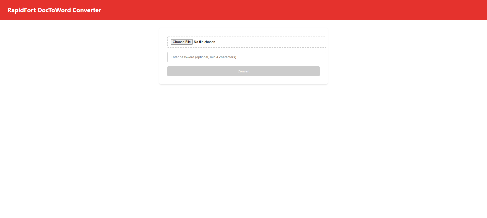
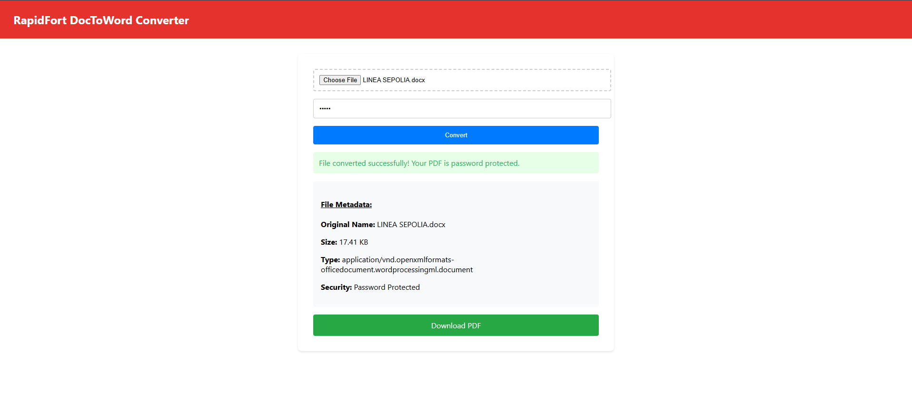

# RapidFort DocToWord Converter

A powerful and efficient tool to convert Word documents to PDF format with ease!


https://github.com/user-attachments/assets/2286ab76-4a33-4135-9c28-4ce1e41a8725


## Table of Contents

- [Overview](#overview)
- [Screenshots](#screenshots)
- [Technologies Used](#technologies-used)
- [Getting Started](#getting-started)
  - [Prerequisites](#prerequisites)
  - [Installation](#installation)
  - [Running the Project](#running-the-project)

## Overview

- **File Conversion:** Utilizes the *docx-pdf* library for converting Word documents to PDFs.

- **Dockerized Server:** The project server is fully containerized using Docker to ensure portability and scalability. Docker image available [here](https://hub.docker.com/r/hjain2003/rapidfortserver)

- **CI/CD Integration:** GitHub Actions is configured to automatically build and push the latest Docker image to Docker Hub after every code change.

- **User-Friendly Bash Script:** A bash script is provided to allow users to pull and run the latest Docker image with a single mouse click or command.

- **Kubernetes Deployment:** Deployment and service manifest files are created to deploy and test the application locally using Kubernetes and Minikube

## Screenshots

Landing Page


Output with file metadata and download link


## Technologies Used

### Frontend
- ReactJS - Javascript framework
- Tailwind CSS - Utility-first CSS framework

### Backend
- Node.js - Runtime environment
- Express.js - Web application framework

### Testing & Development
- Axios - HTTP client for API requests
- Postman - API testing and documentation

### Other Backend Libraries
- phantomjs-prebuilt - Headless browser for PDF generation
- cors - Cross-Origin Resource Sharing middleware
- docx-pdf - Document conversion utility
- multer - File upload handling

## Getting Started

Follow these instructions to get the project running on your local machine.

### Prerequisites

Ensure you have the following installed:
- Node.js (Latest LTS version)
- npm (Comes with Node.js)
- Git
- Docker (For containerized deployment)
- Kubernetes
- Minikube (For local Kubernetes development)

### Installation

1. Clone the Repository
   ```bash
   git clone https://github.com/hjain2003/RapidFort.git
   cd RapidFort
   ```

2. Set Up Backend
   ```bash
   cd server
   npm install
   ```

3. Set Up Frontend
   ```bash
   cd client
   npm install
   ```

### Running the Project

Choose one of the following methods to run the server:

#### 1. [METHOD 1]: Docker Deployment

- For Linux/macOS:
  ```bash
  ./run_container.sh
  ```
- For Windows:
  ```bash
  run_container.bat
  ```

#### 2. [METHOD 2]: Kubernetes Deployment on Local Machine
- Start minikube:
    ```bash
    minkube start
    ```
- Apply the configuration files:
    ```bash
    cd k8s
    kubectl apply -f deployment.yaml
    kubectl apply -f service.yaml
    ```
- Check deployment, pods and services:
    ```bash
    kubectl get deployment
    kubectl get pods
    kubectl get services
    ```
- Use Minikube tunnel:
    ```bash
    minikube tunnel
    ```
- The server will be hosted on <your_minikube_ip>:5000. To find your minikube ip addr:
    ```bash
    minikube ip
    ```

The client application will be available at [http://localhost:3000](http://localhost:3000) which you can access via "npm start" in client folder

